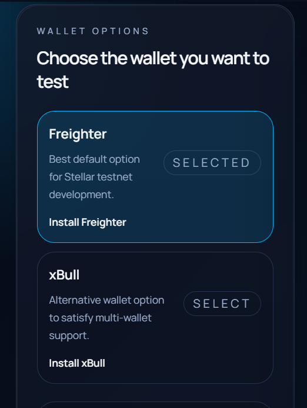
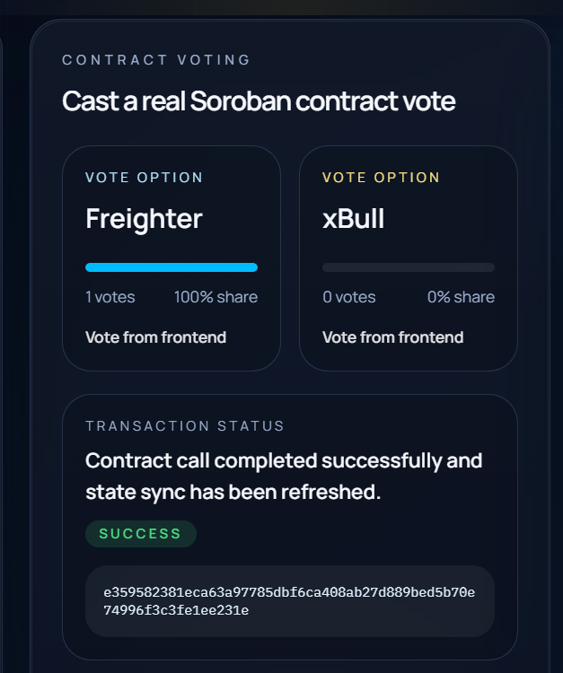
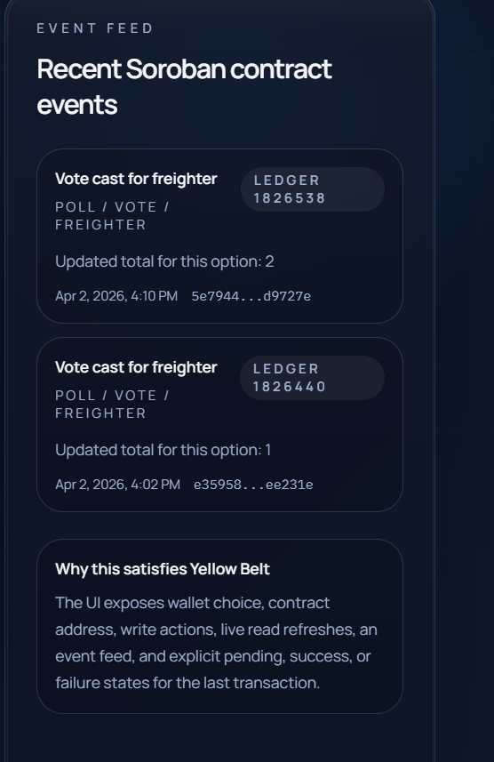
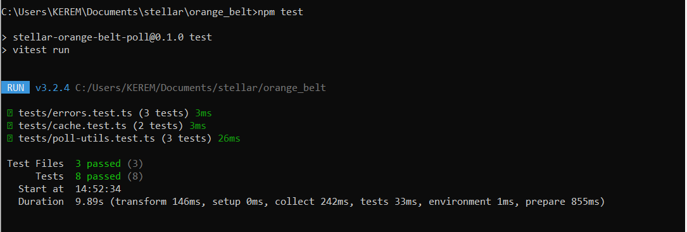

# Orange Belt Live Poll

A Stellar Orange Belt submission project built in `C:\Users\KEREM\Documents\stellar\orange_belt`.

This mini-dApp extends the Yellow Belt Soroban poll into a more complete end-to-end project with:

- visible loading states and progress indicators
- basic client-side caching for poll data and event history
- automated tests for helper and cache logic
- complete submission documentation
- a structure ready for a one-minute demo video

## Project Idea

This project is a `Live Poll` dApp on Stellar testnet.

Users connect a wallet, cast a Soroban contract vote from the frontend, watch transaction status change in real time, and see recent contract events update in the UI. Orange Belt improvements make the experience feel more complete: cached startup data, stronger loading feedback, and documented test coverage.

## Features

- multi-wallet selection with `Freighter` and `xBull`
- deployed Soroban contract on testnet
- frontend contract reads and writes
- event feed synchronized from Soroban RPC
- pending, success, and error transaction states
- cached contract snapshot stored in `localStorage`
- test suite for core helper logic

## Tech Stack

- `Next.js 16`
- `TypeScript`
- `Tailwind CSS 4`
- `@creit.tech/stellar-wallets-kit`
- `@stellar/stellar-sdk`
- `Soroban SDK`
- `Vitest`

## Local Setup

1. Open this folder:

```bash
cd C:\Users\KEREM\Documents\stellar\orange_belt
```

2. Install dependencies:

```bash
npm install
```

If Windows dependency scripts cause issues, use:

```bash
npm install --ignore-scripts
```

3. Create the environment file:

```bash
copy .env.example .env.local
```

4. Add your deployed contract ID inside `.env.local`.

5. Start the app:

```bash
npm run dev
```

6. Open `https://localhost:3000`.

## Environment Variables

```env
NEXT_PUBLIC_STELLAR_RPC_URL=https://soroban-testnet.stellar.org
NEXT_PUBLIC_HORIZON_URL=https://horizon-testnet.stellar.org
NEXT_PUBLIC_NETWORK_PASSPHRASE=Test SDF Network ; September 2015
NEXT_PUBLIC_CONTRACT_ID=
```

## Smart Contract

The contract source lives in [contract/src/lib.rs](./contract/src/lib.rs).

Available functions:

- `vote(voter, option)`
- `get_freighter_votes()`
- `get_xbull_votes()`

Each vote publishes a contract event, which the frontend reads and renders in the event feed.

## Testing

Run the automated tests with:

```bash
npm test
```

The suite covers:

- error classification
- cache parsing and freshness detection
- helper formatting and vote-share calculations

## How To Test The App Manually

1. Open the app on localhost.
2. Select `Freighter` or `xBull`.
3. Connect the chosen wallet.
4. Confirm the connected wallet address and XLM balance appear.
5. Cast a vote from the frontend.
6. Approve the wallet signature request.
7. Confirm the transaction status changes from `pending` to `success` or `error`.
8. Confirm the latest transaction hash appears.
9. Confirm the event feed updates.
10. Refresh the page and verify cached data loads before the next live sync.

## Deployment Details

Live demo link: [TODO](https://stellar-orange-belt-3688.vercel.app/)

Deployed contract address: `CAESJO4OW7Y57JR2Z4RHP4CXVYTKCYTDNEZ465DNXZW4UUASNQLWJXZZ`

Contract explorer:
[Open contract on Stellar Expert](https://stellar.expert/explorer/testnet/contract/CAESJO4OW7Y57JR2Z4RHP4CXVYTKCYTDNEZ465DNXZW4UUASNQLWJXZZ)

Contract call transaction hash: `5e79446a6915015286c7aceab6a194b2805922f5055db2d215a7b8f1b4d9727e`

Transaction explorer:
[Open transaction on Stellar Expert](https://stellar.expert/explorer/testnet/tx/5e79446a6915015286c7aceab6a194b2805922f5055db2d215a7b8f1b4d9727e)

## Deploy To Vercel

The easiest Orange Belt deployment path is `Vercel`.

Recommended steps:

1. Push this folder to a public GitHub repository.
2. Import the repository into Vercel.
3. If the repository contains multiple folders, set the project root to `orange_belt`.
4. Add these environment variables in the Vercel project settings:
   - `NEXT_PUBLIC_STELLAR_RPC_URL`
   - `NEXT_PUBLIC_HORIZON_URL`
   - `NEXT_PUBLIC_NETWORK_PASSPHRASE`
   - `NEXT_PUBLIC_CONTRACT_ID`
5. Redeploy after saving the environment variables.
6. Copy the generated `https://...vercel.app` link into the `Live demo link` field above.

Suggested verification after deploy:

- connect Freighter on testnet
- cast one vote
- confirm transaction status becomes `success`
- confirm the event feed updates
- refresh the page and confirm cached data appears before the next live sync

## Demo Video

Demo video link: TODO

## Screenshots

Save final assets under `public/screenshots/`:

- `wallet-options.png`
- `contract-success.png`
- `event-sync.png`
- `test-output.png`

### Wallet Options Available



### Successful Contract Call



### Real-Time Event Sync



### Test Output Showing 3+ Passing Tests



## Submission Checklist

- Public GitHub repository
- README with complete documentation
- Minimum 3+ meaningful commits
- Live demo link
- Demo video link
- Screenshot showing 3+ tests passing

## Suggested Orange Belt Commit Plan

1. `promote yellow belt dapp into orange belt workspace`
2. `add cache hydration and stronger loading states`
3. `add orange belt test coverage and complete documentation`

## Useful Links

- [Stellar Developers](https://developers.stellar.org/)
- [Stellar Wallets Kit](https://github.com/Creit-Tech/Stellar-Wallets-Kit)
- [Soroban Contract Events](https://developers.stellar.org/docs/learn/fundamentals/contract-development/events)
- [Contract Lifecycle](https://developers.stellar.org/docs/tools/cli/cookbook/contract-lifecycle)
- [Vercel Next.js Deployment](https://vercel.com/docs/frameworks/nextjs)
